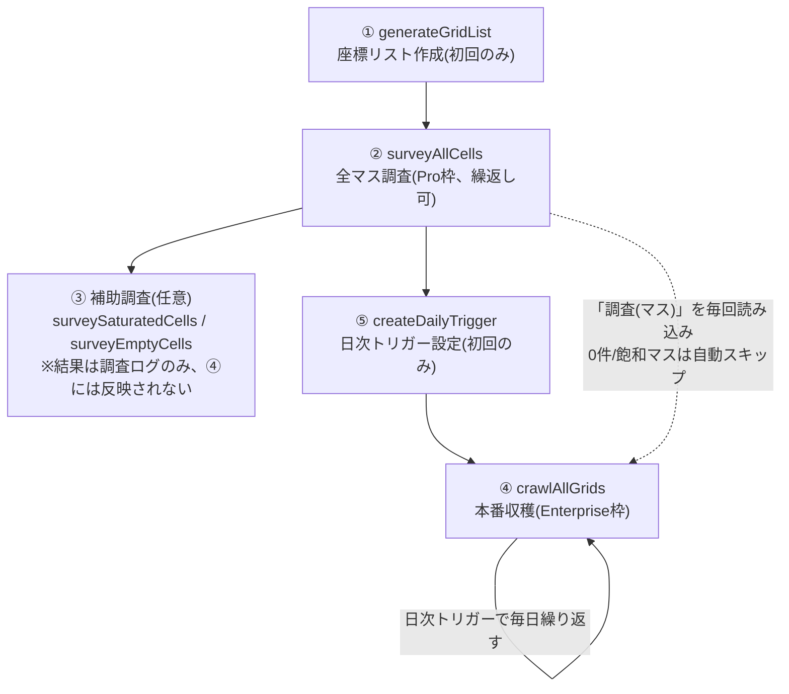

# 現在のワークフロー(実行順)

①②⑤は基本1回きりの準備、④(`crawlAllGrids`)だけが日次トリガーで永続的にループし続ける実行部分。
④は実行のたびに②の調査結果(「調査(マス)」シート)だけを読み込み、答えが分かっている「0件」「飽和」マスへの
APIコールを自動でスキップする。

③(`surveySaturatedCells`/`surveyEmptyCells`)は②の結果のうち「20件以上(飽和)だったマス」や
「0件と予測されたマス」だけを対象にした補助調査で、結果は`調査(分割マス)`/`調査ログ`シートに残るのみ。
④はここを読まないため、③の結果は自動反映されない(人間が見るための調査ログ)。

